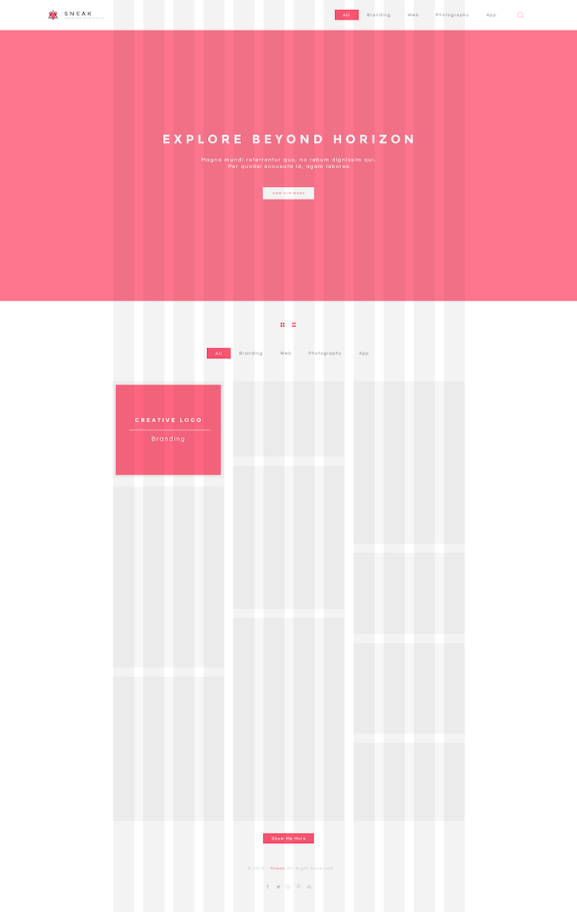

# SNEAK: Creative portoflio

**Front-end development challenge**

Website layout and develop the home of this design.

## Details of challenge 

### Conditions

La fuente es Google Montserrat and Questrial.

Las imágenes para el portafolio puede usar https://unsplash.com/

La versión responsive debe llevar un estilo de menú mobile.

- no se pueden utilizar frameworks css.
- no se puede utilizar jquery, ni frameworks javascript.
- Puede utilizar _run taskers_, y preprocesadores css
- la sección la grilla de portafolio, debe traerse dinámicamente con un json.
- usar hml5
- usar javascript en las últimas versiones es6, es7, es8.

### Design



## Results

El MVP se puede probar [aquí demo](https://jhnemogap.github.io/tita-media-cc-01/).

Todos los enlaces y botones son funcionales _(excepto los iconos del pie de página [footer])_.

### Como usar

En este proyecto se usa `yarn` como gestor de dependencias de Node.js, en concreto 
la versión 1.22.x.

Se hace uso de mecánismo de variables de entorno con `dotenv`, por lo tanto la 
url y llave de la api de imágenes se deben colocar en un archivo local llamado 
`env`, siguiendo la misma estructura de `.env.example`

#### Instalar las dependencias

```bash
yarn install
```
#### Ejecutar el modo de desarrollo en local

```bash
yarn dev
```
#### Compilar el proyecto para production

```bash
yarn build
```

#### Realizar el despliegue en GitHub pages

Este commando requeire que previamente se cuente con el proyecto compilado para 
producción `yarn build`

```bash
yarn deploy:gh-pages
```

#### Comandos extras

Elimina las carpetas y sus archivos que se generan al ejecutar el modo de desarrollo 
o la compilación de producción.

```bash
yarn clean
```

### Estructura de archivos y directorios

- **Directorio raíz**
  - _.gitignore_
  - _package.json_
  - _.nvmrc_: archivo de configuración del Node Version Manager (NVM).
  - _.env.example_: indica como ejemplo que datos debe llevar el archivo de 
    variables de entorno.
  - **public**: se alojan las imágenes, fuentes o cualquier asset.
  - **readmeAssets**: cualquier asset a usar solamente para documentar el README.md.
  - **src**
    - _index.html_: es el archivo de inicio
    - _index.js_: contiene todo el javascript requerido hasta el momento 
      _(se debería separar en componentes)_
    - **styles**: tiene todos los estilos organizados por carpetas, según el 
      sistema de diseño creado para este proyecto. Es inspirado en parte por 
      framework css como bootstrap, foundation o tailwind.
    - **components** _(futuro)_: debería contener en carpetas individuales los 
      archivos de lógica y estilos de cualquier sección que merezca el esfuerzo 
      a ser tratada como un componente

### Herramientas y tecnologías empleadas

- HTML5
- JavaScript: vanilla / nativo
- [Sass](https://sass-lang.com/guide): para los estilos
- [Parcel v2](https://v2.parceljs.org/): Parcel is a compiler for all your code, 
  regardless of the language or toolchain.
- [Pexels](https://www.pexels.com/api/documentation/): API de imágenes 
  _([limitaciones de uso](https://www.pexels.com/api/documentation/#guidelines))_

## Notas al aire

> En caso de NO usar Sass y haber usado CSS3 nativo, ¿Parcel v2, se puede omitir su uso?

Sí, es posible. Pero sería necesario retirar el uso automático que entrega 
Parcel v2 en este proyecto de:

- uso de las variables de entorno con archivos `.env`
- inicio de un servidor de desarrollo
- compilar el proyecto optimizado para producción
- [Hot Module Replacement (HMR)](https://v2.parceljs.org/features/hmr/)

> Algunas dimensiones, proporciones y colores no se respetaron exactamente al 
> diseño, ¿Por qué?

1. Lo primero y más importante fue que el diseño se replanteó para ser mobile-first.
2. El tamaño de algunos elementos eran muy pequeños, y es agotador para muchos 
   usuarios dar clic en esas zonas reducidas.
3. Los colores se ajustaron lo necesario para cumplir al menos con el contraste 
   doble-A (AA) de accesibilidad web.

> ¿Algo más que sea medianamente interesante de revisar en el repositorio fuera del código?

- [El histórico de despliegues](https://github.com/jhnemogap/tita-media-cc-01/deployments)
- [Control de ramas](https://github.com/jhnemogap/tita-media-cc-01/network): 
  esto si no se quiere inspeccionar el flujo de trabajo direcamente con GIT en local.
- [histórico de issues](https://github.com/jhnemogap/tita-media-cc-01/issues?q=is%3Aissue+is%3Aclosed)
- [histórico de PR](https://github.com/jhnemogap/tita-media-cc-01/pulls?q=is%3Apr+is%3Aclosed)
